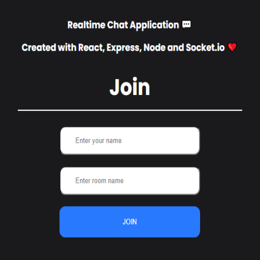

# Socket Chat

## Demo

# Local launch

0. Clone repo: `git clone https://github.com/AbayIbrayev/react-chat.git`
1. `cd react-chat`
2. `cd server`
3. Install dependencies with `yarn` or `npm install`
4. Run backend server with `yarn start` | `npm run start` (check [localhost:5000](http://localhost:5000/))
5. Repeat 1-3 steps with `client` directory
6. Check your `localhost:3000`, for a local preview

---

Thank you!
